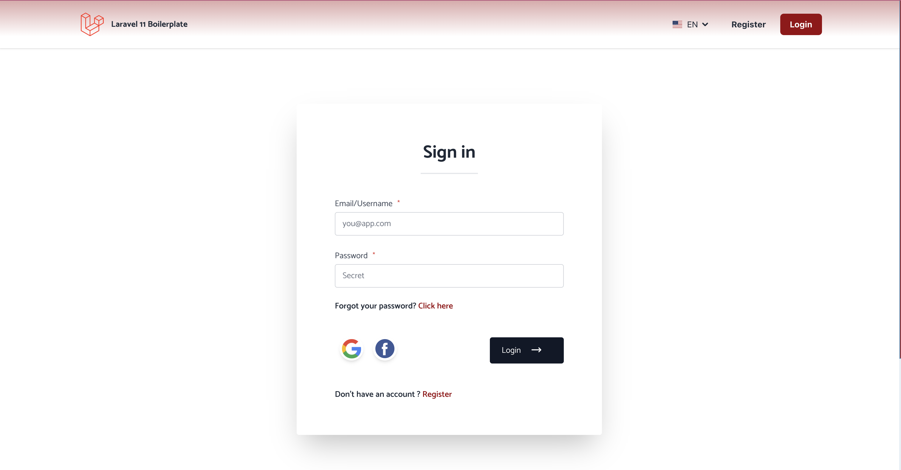

<div align="center">
    <h1 align="center">L11 BOILERPLATE</h1>
    <a href="https://laravel-demo.muarachmann.com" target="_blank">
        
    </a>
</div>

<p align="center">
<a href="https://travis-ci.org/laravel/framework"></a>
<a href="https://packagist.org/packages/laravel/framework"></a>
<a href="https://packagist.org/packages/laravel/framework"></a>
</p>

<p align="center">
    
</p>

## Introduction
L11 SPA Boilerplate is a platform that tries to bootstrap a laravel 11 application using 
inertia js, vue2, tailwinds and common presets.
## Table of Contents

1. [Requirements](#requirements)
2. [Features](#features)
3. [Installation](#installation)
4. [Usage](#usage)
5. [Documentation](#documentation)
6. [Change log](#change-log)
7. [Testing](#testing)
8. [Contributing](#contributing)
8. [References](#references)
9. [Security](#security)
10. [Credits](#credits)
11. [License](#license)


## Requirements
Make sure your server meets the following requirements.

-   Apache 2.2+ or nginx
-   MySQL Server 5.7.8+ , Mariadb 10.3.2+ or PostgreSQL
-   Composer installed 2.90
-   PHP Version 8.2+
-   Node v16.4.2 / NPM 7.19.1

### PHP extensions

Make sure you have the following php extensions enabled
```
bz2, curl, date, dom, exif, gd, gettext, grpc,
imagick, intl, json, libxml, mbstring, fileinfo, redis, mysqli, mysqlnd, openssl, PDO,
pdo_mysql, posix, protobuf, soap, sqlite3, xml, xmlreader, xmlrpc, xmlwriter
xsl, zip, zlib
```

### Tech Stack

This application is built using (php, Laravel 11, Vue2, tailwindcss, intertiaJs)
Please  be sure to google about this stack in order to better understand.
Also, as side note, we use other platforms and tools for smooth integration such as

`sentry, google-recaptcha, pusher, mailgun`. The links are available in the [References](#references) section
below


## Features
It packs in lots of demanding features that allows to scale in no time:

- [x] Admin Portal
- [x] Roles and Permissions
- [x] Auth Screens
- [x] CI/CD Pipelines & Auto Deploying to server(s) with zero downtime
- [ ] More Features coming

## Code Quality/Tools
Make sure your server meets the following requirements.

-   [Php CodeSniffer](https://github.com/squizlabs/PHP_CodeSniffer)


## Installation

Install composer with the help of the instructions given [here](https://getcomposer.org/doc/00-intro.md#installation-linux-unix-macos)
``` bash  
$ wget https://getcomposer.org/composer.phar
$ chmod +x composer.phar
$ mv composer.phar /usr/local/bin/composer
```  

Install Node.js/NPM with the help of the instructions given [here](https://nodejs.org/en/download/package-manager/)
However it is good to use node version manager (nvm) in order to manage and choose the correct node version.


Linux/Unix `yum install npm` OR using MacOs `brew install node`

Fork and/or clone this project by running the following command
``` bash  
$ git clone https://github.com/muarachmann/laravel11-spa-boilerplate
```

Navigate into the project's directory
``` bash  
$ cd laravel11-spa-boilerplate
```

Copy .env.example for .env and modify according to your credentials
```bash
cp .env.example .env
```

Run this command to install dependencies
```bash
composer install --prefer-dist
```
This command will install all dependencies needed by the platform to run successfully!

Generate application key
```bash
 php artisan key:generate
```

Install npm/yarn dependencies  (Preference is using **Yarn**)
```bash
npm install or yarn install 
```

## Database Setup

First we have to migrate and seed the app's database, which has vital information about the functioning of the various
other modules such as lab tests, doctors exams etc
```bash
php artisan migrate:fresh --seed 
```
**Note:** This is always clear any information and reseed, use it wisely a better option when modifications are done is to
migrate and reseed.


## Usage

NB: It is advisable to install [valet](https://laravel.com/docs/valet) in order to better test functionality
If you are on a Linux based OS. Make sure to install its own version [valet-linux](https://cpriego.github.io/valet-linux/)
**notice** While I haven't tried on a windows machine feel free to explore - https://medium.com/@samimrezgui123/how-to-install-laravel-valet-on-windows-os-afdc23d69719

Once valet is setup, navigate to http://laravel11-spa-boilerplate.test

Run yarn/npm in dev mode
`npm run dev` OR `yarn run dev`


## Running Jobs with Supervisor/Redis

Install [supervisor](http://supervisord.org/) and [redis](https://redis.io/download)

Create a configuration file and place this contents into it:
Make sure to replace <path>/<to>/<laravel11-spa-boilerplate> with your actual path and <user> with your user.
Feel free to customize this to your own taste.

```bash
[program:app_horizon]
process_name=%(program_name)s
command=php <path>/<to>/<laravel11-spa-boilerplate>/artisan horizon
autostart=true
autorestart=true
user=<user>
redirect_stderr=true
stdout_logfile=<path>/<to>/<laravel11-spa-boilerplate>/storage/logs/horizon.log
stopwaitsecs=3600
```

Please see the [changelog](changelog.md) for more information on what has changed recently.

## Testing

// todo

Run the tests using:
``` bash  
$ composer test  
```  

## Troubleshooting

Before opening an issue, please refer to the [troubleshoot guide](troubleshooting.md)

## Contributing

Please see [contributing.md](contributing.md) for details and a todolist.

## References

Please see [contributing.md](contributing.md) for details and a todolist.


## Documentation
- Official documentation is available [Soon](https://docs.laravel11-spa-boilerplate.com).


## Security

If you discover any security related issues, please email muarachmann@gmail.com instead of using the issue tracker.

## Credits

- [Mua Rachmann](https://github.com/muarachmann)

## License

MIT. Please see the [license file](license.md) for more information.  
